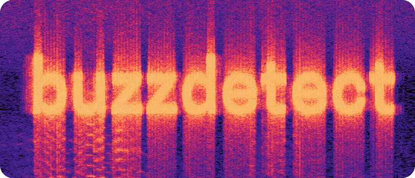

# buzzdetect

    

## Introduction
buzzdetect is a machine learning based python tool for automated biacoustic surveys of honey bees. buzzdetect is capable of processing arbitrarily large audio files of virtually any type and producing second-by-second annotations of the sounds identified in the files. It outputs results as CSV files for easy transfer into other data processing software. 

### Performance
The accuracy of buzzdetect varies between models. Check out the README files in each model saved in [the models folder](https://github.com/OSU-Bee-Lab/buzzdetect/tree/main/models).

The speed of buzzdetect varies between models and the machine running the computation. On our YAMNet-based models running on CPU, per-process performance is roughly 30x–60x realtime. An average laptop with a solid state hard drive processing on 8 logical CPUs will probably process an hour of audio in about 15 seconds. However, processing is massively faster on GPU. We use an NVIDIA GeForce GTX 1650 and see analysis rates of about 1,200x realtime.

### Models
Find our models [here](https://github.com/OSU-Bee-Lab/buzzdetect/tree/main/models).

The models that buzzdetect applies to data are still rapidly evolving.
We will publicly host a selection of models that we believe to be production-ready, as well as performance metrics to aid in the interpretation of their results.

### Transfer learning
Our models are based on the strategy of transfer learning. In brief, this means we do not feed our bespoke models audio data directly, but instead preprocess the data using an existing audio classification model. This allows us to create a highly performant model on a relatively small dataset. The first model extracts relevant features from the audio data and represents them in a lower-dimensional space called the "embedding space." Our models are trained on those smaller and more information-dense embeddings.

Currently, we are training our models on embeddings from the Google Tensorflow model [YAMNet](https://github.com/tensorflow/models/blob/master/research/audioset/yamnet/yamnet.py).
  

## Quick Start Guide
### First time steup
Full documentation [here](https://github.com/OSU-Bee-Lab/buzzdetect/blob/main/documentation/firstTimeSetup.md).

1. Install the environment manager [conda](https://conda.io/projects/conda/en/latest/user-guide/install/index.html)
2. Clone the buzzdetect files from this github repo to the directory where you want to store buzzdetect. We'll refer to this directory as the "project directory."
3. Open a terminal in the project directory
4. Run the command: `conda env create -f environment.yml -p ./environment`
  - the -p argument is the path where the conda environment will be created. The above command creates the environment as a subdirectory of the project directory, but you can choose to install it elsewhere.
5. Conda will create the environment and install all required packages

You are now ready to run your first analysis!

### Analyzing audio
Full documentation [here](https://github.com/OSU-Bee-Lab/buzzdetect/blob/main/documentation/analysis.md).
1. buzzdetect looks for audio files to analyze in the `./audio_in` directory. Place the audio you want to analyze in this directory.
     - Audio files can be of any format that [the soundfile package](https://python-soundfile.readthedocs.io) supports; see supported types [here](http://www.mega-nerd.com/libsndfile/#Features).
     - Audio files do not need to be in the root level of the `./audio_in` directory. You can have them stored in any structure you like. buzzdetect will clone the input directory structure to the output folder. For example, the results of the audio file `./audio_in/visitation_experiment/block 1/recorder4.wav` would be written to `./models/[model used in analysis]/output/visitation_experiment/block 1/recorder4_buzzdetect.csv`
3. Open a terminal in the project directory and activate the conda environment by running the command `conda activate ./environment`
5. Analyze the audio files with the following command: `python buzzdetect.py analyze --modelname [model to use]`
    - By default, analysis uses a single process. To parallel process, use the `--cpus` option with the number of CPU cores you want to employ.
    - See the comprehensive command-line documentation [here](https://github.com/OSU-Bee-Lab/BuzzDetect/blob/main/documentation/commandLineInterface.md) for additional configuration options.
6. The results will be output as .csv files in the `/output` subdirectory of the model's directory.

### Training a new model
Full documentation [here](https://github.com/OSU-Bee-Lab/buzzdetect/blob/main/documentation/training.md).

You may want to train a model for your specific environment. For example, you may find that one of your sites is producing false positives due to a source of sound not in the buzzdetect training set. Or else, you may want to tinker with the existing metadata and train a new model on the modified result. You could even train a buzzdetect model on an entirely new dataset to try to monitor different sounds such as frog calls, traffic density, or weather events (though we can't promise performance for these tasks). Following is a bare-bones guide to training a new model:

1. Obtain training audio files and a corresponding metadata CSV
  - Optionally, you can create a CSV containing custom weights for each class
  - See [the full documentation](https://github.com/OSU-Bee-Lab/buzzdetect/blob/main/documentation/training.md) for details on the audio data and contents of the metadata CSV.
3. Place the training audio in `./training/audio` and the metadata in `./training/metadata`
     - If you're using custom weights, place the weights file in `./training/weights`
4. Open a terminal in the root project directory
5. Run the command `conda activate ./environment`
6. Run the command `python buzzdetect.py train --modelname [any model name you like] --metadata [name of your metadata csv]`
     - If you're using weights, also include the option `--weights [name of your weights csv]`
8. A new tensorflow model will be trained and saved to `./models/[your chosen model name]`
9. Your model is now ready for use in analysis!

