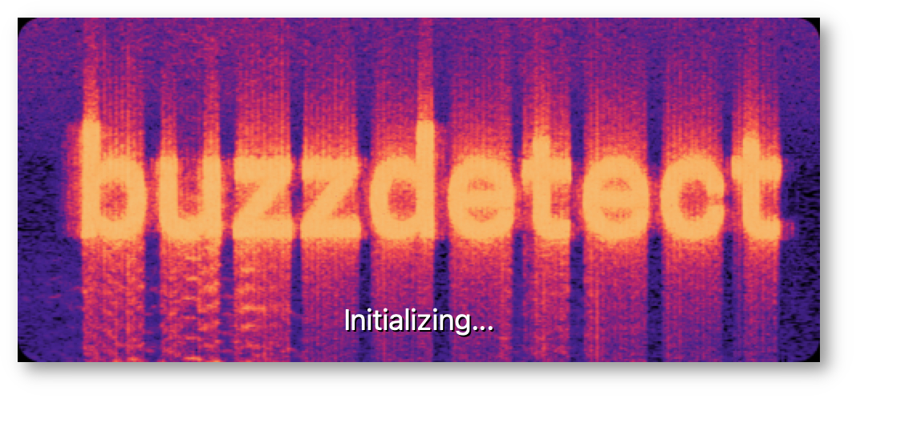
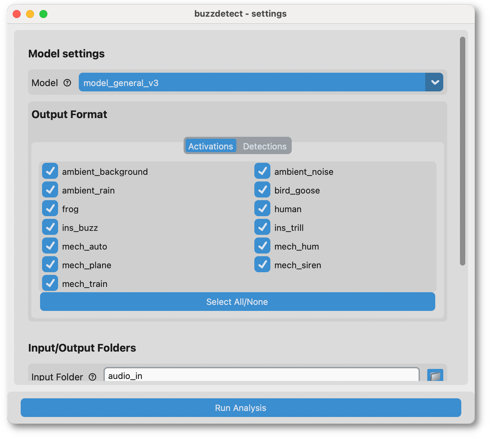
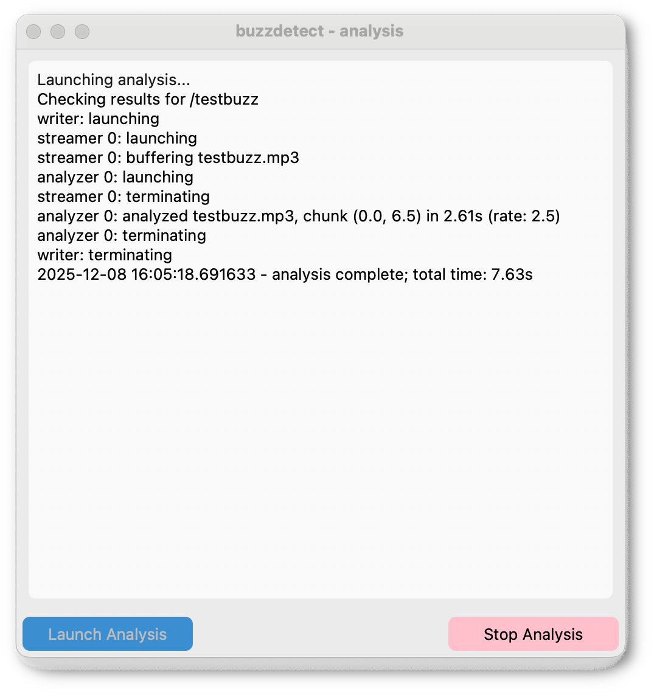

Graphical Interface
================================

A lightweight graphical user interface (GUI) is available to facilitate audio analysis.
Currently, the GUI is primarily an interface to control analysis settings;
quality of life features such as progress bars and ETAs are planned features,
but are currently low priority.

This documentation is for user interaction with the GUI.
For an overview of the general buzzdetect workflow and advice on analysis, see the :doc:`workflow documentation <workflow>`.

We use `CustomTkinter <https://customtkinter.tomschimansky.com/>`_ for our user interface.
Visual issues such as blurry or aliased text are likley downstream of issues with CustomTkinter,
not buzzdetect!

Launching analysis
-------------------

1. In the project directory, activate your Conda environment with `conda activate ./.venv``.
2. Run ``python buzzdetect_gui.py``
    - You should see the splash screen (pictured above) while the program loads.
    - Loading usually takes several seconds. The first time loading, it may take a little under a minute.

Settings
---------

On this screen, you can modify your analysis settings.

    - **Model:** Select the model with which to analyze audio.
        - We release our latest models on the `buzzdetect GitHub repository <https://github.com/OSU-Bee-Lab/buzzdetect/tree/main/models>`_.
          New models will be added as they are developed.
    - **Output Format:** buzzdetect results can be written as raw neuron activations or as binary detections.
        - When the "Activations" tab is selected, results will be written as neuron activations.
          Each neuron will produce one column in the output CSV, named with the pattern: "activation_[neuron]". E.g., "activation_ins_buzz".
          The checkboxes can be used to choose which classes are written to the results file.
        - When the "Detections" tab is selected, results will be written as binary detections.
          The user can specify a desired precision value (the probability of a true buzz given a detected buzz),
          and detections will automatically be called for each frame. Currently, only the ins_buzz neuron is supported
          when using detection-formatted output. The corresponding column will be named "detections_ins_buzz".
    - **Input/Output Folders:** Select the folder containing the audio to be analyzed and the folder where results files should be written.
      buzzdetect will search recursively through the input folder for all `supported audio file types <https://python-soundfile.readthedocs.io/en/0.13.1/#read-write-functions>`_.
      The names and structure of the output files will be identical to that of the input files, the the addition of a "_buzzdetect" suffix and the change of the extension to CSV.
    - **CPU Analyzers:** The number of CPU-based analyzers to launch for analysis.
      This is *not* the same as the number of CPU cores to use for analysis!
      buzzdetect always launches multiple parallel processes and allows TensorFlow to control the number of CPU threads to leverage for applying the models.
      See :ref:`the performance tuning documentation <tuning>` advice on tuning the number of CPU workers.
    - **GPU Analyzer:** Whether or not to launch a GPU-based analyzer for analysis.
      This requires a CUDA-capable GPU and a modified environment.yml as described in :ref:`the setup documentation <conda_env>`.
      See :ref:`the performance tuning documentation <tuning>` for advice on getting the best performance from the GPU worker.
    - **Chunk length:** Input audio files are split into smaller chunks in memory.
                        This setting controls the size (in seconds) of those chunks.

Analysis
--------

This window displays messages from the analysis while it runs.
Mostly, this is here to assure users that the analysis is running as-expected.
