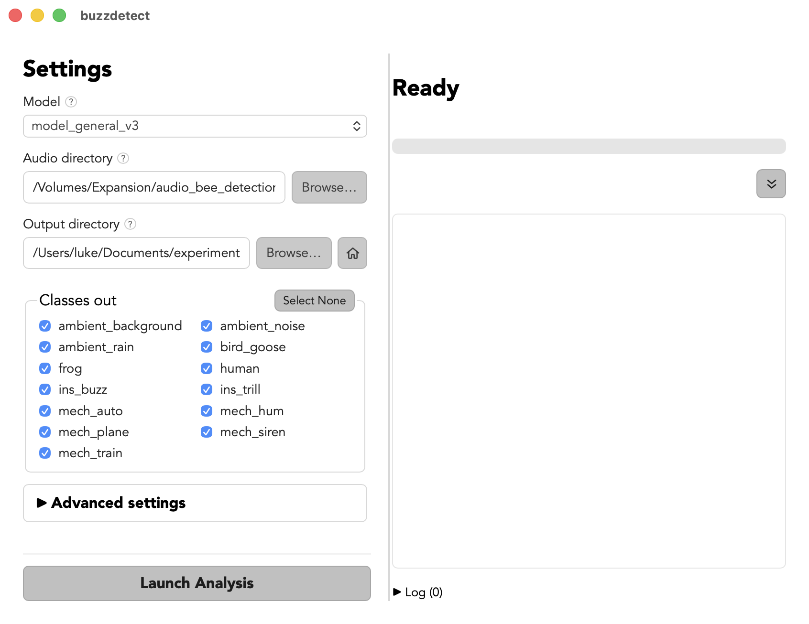

Desktop app
================================

The buzzdetect desktop app is a user-friendly front end wrapping the underlying buzzdetect engine.
At it's simplest, you pick a buzz detection model, a folder of audio files, and a folder you want to write results to.
buzzdetect applies the model to the audio, shows progress live, and gives you some metrics for the analysis (audio to analyze, analysis rate, estimated time remaining, etc.).
The app is fully self-contained, you don't need to install any extra dependencies.

    The app on launch, before an analysis has started.

Basic settings
---------------

- **Model:** choose your model for analysis. buzzdetect ships with our latest and greatest, or you can import your own.
  Click the **Info** button next to the picker to see the model's description and its recommended detection thresholds (see :doc:`result_files`).
- **Audio directory:** the folder of audio to analyze. buzzdetect searches it recursively for supported audio files.
- **Output directory:** the folder where result CSVs are written. The log and a buzzdetect_manifest.json file are also saved to this folder. 
  Future analyses targeting this directory will be locked to any settings that would change the results (see :doc:`result_files`).
- **Classes out:** choose which of the model's classes you want to write to the results file.
  We optimize for ins_buzz and don't promise performance on other classes, but some (especially ambient_rain) may be of interest.

Advanced settings
-------------------

These are for the power users who want to squeeze every last drop out of the performance.
Depending on your machine (especially if you're analyzing on GPU), the default settings could be a major bottleneck.
For more details on these settings and on tuning analyses, see :doc:`tuning`.

- **Chunk length (s):** buzzdetect chunks long audio files into pieces to feed to the analyzer(s). This setting controls the size of those chunks.
- **CPU analyzers** / **GPU analyzers:** how many CPU- and GPU-based workers to launch. The GPU
  option only appears once the app has probed this machine and confirmed a usable GPU.
- **Reduced precision (fp16):** Apple GPUs only. Runs the model at half precision on Apple's Neural Engine.
  This can be roughly twice as fast, unless you're IO bottlenecked.
  It shifts the activations by a very little bit, but after applying a detection threshold
  the results are essentially identical.
- **Concurrent streamers*:** how many concurrent workers should be reading audio files? This will require some tuning, but the faster your analyzer the more streamers you'll need.
- **Stream buffer depth:** streamers put their chunks on a buffer that the analyzer(s) pull from. How many chunks should that buffer hold before streamers need to wait?
- **Import model:** You can add your own models, so long as they conform the the format we use. You can pick a folder or a ``.zip`` to copy it into the app for future use.

Once you click **Launch Analysis**, see :doc:`gui_analysis` for what to expect while it runs and after it stops.
