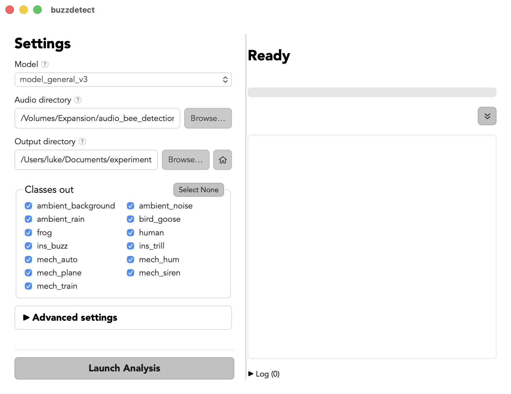

Desktop app
================================

The buzzdetect desktop app is a user-friendly front end wrapping the underlying buzzdetect engine.
At it's simplest, you pick a buzz detection model, a folder of audio files, and a folder you want to write results to.
buzzdetect applies the model to the audio, shows progress live, and gives you some metrics for the analysis (audio to analyze, analysis rate, estimated time remaining, etc.).
The app is fully self-contained, you don't need to install any extra dependencies.

    The app on launch, before an analysis has started.

Basic settings
---------------

- **Model:** choose your model for analysis. buzzdetect ships with two models, ``balanced_v1`` and ``heavy_v1``.
  The model's description is shown under the picker.
  Click **View Models** to read a model's documentation, download others, or import your own (see `Models window`_ below).
- **Audio directory:** the folder of audio to analyze. buzzdetect searches it recursively for supported audio files.
- **Output directory:** the folder where result CSVs are written. The log and a buzzdetect_manifest.json file are also saved to this folder. 
  Future analyses targeting this directory will be locked to any settings that would change the results (see :doc:`result_files`).
- **Classes out:** choose which of the model's classes you want to write to the results file.
  We optimize for ins_buzz and don't promise performance on other classes, but some (especially ambient_rain) may be of interest.
  Once an output folder has results, its classes are locked to match them.

Advanced settings
-------------------

These are for the power users who want to squeeze every last drop out of the performance.
Depending on your machine (especially if you're analyzing on GPU), the default settings could be a major bottleneck.
For more details on these settings and on tuning analyses, see :doc:`tuning`.

- **Chunk length (s):** buzzdetect chunks long audio files into pieces to feed to the analyzer(s). This setting controls the size of those chunks.
- **CPU analyzers** / **GPU analyzers:** how many CPU- and GPU-based workers to launch. The GPU
  option only appears once the app has probed this machine and confirmed a usable GPU.
- **Reduced precision (fp16):** Apple GPUs only. Runs the model at half precision on Apple's Neural Engine.
  This can be roughly twice as fast, unless you're IO bottlenecked.
  It shifts the activations by a very little bit (roughly 0.015), but after applying a detection threshold
  the results are essentially identical. Disabled for models that don't come with a reduced-precision version.
- **Concurrent streamers:** how many concurrent workers should be reading audio files? This will require some tuning, but the faster your analyzer the more streamers you'll need.
- **Stream buffer depth:** streamers put their chunks on a buffer that the analyzer(s) pull from. How many chunks should that buffer hold before streamers need to wait?
- **Console verbosity** / **Log file verbosity:** how much detail the engine writes to the log panel and to the log file in the output folder.
- **Log progress statements to file:** also write the progress reports (e.g., from analyzers) to the log file. Can produce very large log files.
- **Save benchmarks to log:** write how long each stage (reading, resampling, waiting, inference, writing) takes for every chunk, plus a summary at the end of the run.
  Useful when tuning (see :doc:`tuning`).
- **Full quality decoding:** resample audio to the model's sample rate with a slower, more accurate filter.
  The default is about 3x cheaper and adequate for detection, but the activations differ slightly between the two.
  Like the model and classes, this is locked once an output folder has results, so a folder never mixes the two.

Models window
--------------

**View Models** opens a window listing every model you have installed, plus the ones available to download.
Select a model to read its README, which is where we document what it's good at, where it struggles, and suggested detection thresholds.

- **Download** a model to add it to the app. When we publish a fix to a model you've downloaded, it's offered here as an **Update**.
- **Use this model** selects it in the main window.
- **Delete** removes a downloaded or imported model. The bundled models can't be deleted, but **Disable** hides them from the picker.
- **Ignore** stops the app from flagging a model you don't want to download as new.
- **Import from .zip…** adds a model of your own, so long as it follows the format we use.

History
--------

**History** lists your past runs. Select one to see the settings it used, and click **Use these settings** to load them back into the main window.

Once you click **Launch Analysis**, see :doc:`gui_analysis` for what to expect while it runs and after it stops.
