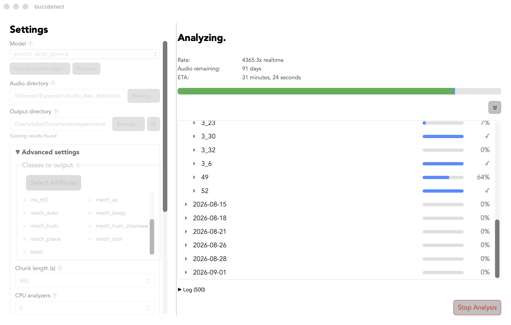
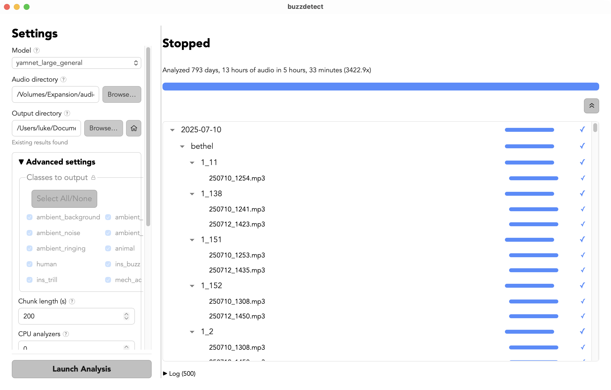

Watching an analysis
================================

Once you click **Launch Analysis**, the right-hand panel populates with the files to analyze and tracks their progress.

While it's running
--------------------

    An analysis in progress.

- **Header:**  The header displays the current state of the engine. "Ready", "Analyzing", "Finished", etc.
- **Rate:** current analysis speed, as a multiple of wall time audio (e.g. ``4365.3x realtime``
  means buzzdetect is analyzing ~1 hour and 12 minutes of recorded audio per second). This number jumps around a lot
  as new files are initialized or if other applications are hogging your computer's resources.
- **Audio remaining:** how much unanalyzed audio is left in the input folder.
- **ETA:** estimated wall-clock time left, based on a moving average of the analysis rate.
  This number is more stable than the rate.
- **Progress bar:** overall completion across every input file. Green is for audio analyzed in a previous session, blue is
  for audio analyzed in this session, gray is not yet started.
- **File tree:** this shows every folder and file under your audio directory and gives each its own progress bar and percentage.
  The progress bars are based on seconds of audio remaining.
  A checkmark appears when a file is finished (and rewritten from _buzzpart.csv to _buzzdetect.csv; see :doc:`/result_files`).
  The expand/collapse button at top will open or close all folders in the preview.
- **Log:** a running log of messages from the engine, useful for troubleshooting. Look here if you hit an error.
- **Stop Analysis:** asks the engine to stop analyzing. While it winds down the button becomes
  **Force Stop**, which kills the engine immediately (see :ref:`stopping-an-analysis` below).

When it's done
----------------

    An analysis that has stopped, with the subtitle reporting overall rate. Not bad!

When an analysis is complete, the header shows "Analysis complete!" and the line below summarizes the job and rate.
If you hit an error, the header will instruct you to check the logs, where you can find the error report.

.. _stopping-an-analysis:

Stopping an analysis
^^^^^^^^^^^^^^^^^^^^^^

Your first click on the ``Stop Analysis`` button sends a request to the engine to gracefully shut down.
This can take a few seconds as all of the workers finish the last task they're processing.
While the engine is winding down, the ``Stop Analysis`` button becomes a ``Force Stop`` button.
If, for some reason, the stop request hangs or you need to kill the task immediately, this button will forcibly end the process.
Because analysis resume where the last one left off, there isn't much of a difference between these options.