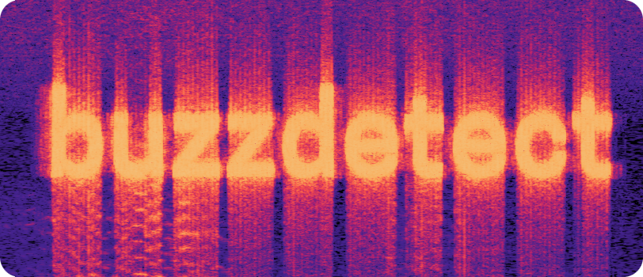

buzzdetect: automated pollinator monitoring
==================================================
.. image:: https://zenodo.org/badge/685544295.svg
   :target: https://doi.org/10.5281/zenodo.15537954

.. image:: https://img.shields.io/github/license/OSU-Bee-Lab/buzzdetect
   :alt: license badge for MIT license

buzzdetect is a tool for passive acoustic monitoring of pollinator activity.
It uses machine learning to analyze audio recordings and identify the buzz of insect flight, enabling highly scalable, temporally rich observation.
Read the peer-reviewed paper `in the Journal of Insect Science <https://doi.org/10.1093/jisesa/ieaf104>`_.
The paper uses the model ``model_general_v3``; similar tests will be performed on all future models and stored in the model folder.

**Citing buzzdetect**.
If you want to cite buzzdetect in a scholarly work, please cite `the paper <https://doi.org/10.1093/jisesa/ieaf104>`_ for the method;
for reproducability, cite and `the Zenodo DOI <https://doi.org/10.5281/zenodo.15537954>`_ corresponding to the version you used in your analysis.

Documentation is still underway; please bear with us!

Key Features
-------------

- **Automated observation.** Enables passive acoustic monitoring of pollinators by detecting the buzz of insect flight in audio.
  Drop your recorders in the field and let them do your observation for you.

- **Big data.** Support for arbitrarily large datasets.
  Input audio files can be days long, input datasets can be years long,
  buzzdetect intelligently streams audio one chunk at a time.
  Interrupted analyses can pick right back up from where you left off - no data lost!

- **From sounds to stats.** Check out our companion package, `buzzr <https://github.com/OSU-Bee-Lab/buzzr>`_ and `our walkthrough <https://lukehearon.com/blog/2026/buzzdetect-walkthrough/>`_
  for everything you need to go from recordings to results.

- **Flexible application.** Support for a wide variety of audio formats, run analyses through command line, Python API, and graphical interface.

- **It's FOSS!** buzzdetect's source code is licensed under MIT, free as in speech, free as in pizza.
  **NOTE:** embedding models could be subject to their own licenses! Check out `NOTICE <https://github.com/OSU-Bee-Lab/buzzdetect/blob/main/NOTICE>`_ and `LICENSES/ <https://github.com/OSU-Bee-Lab/buzzdetect/tree/main/LICENSES>`_ for more info.

.. toctree::
   :maxdepth: 2
   :caption: User Guide

   getting_started
   gui
   result_files
   tuning

.. toctree::
   :maxdepth: 2
   :caption: Reference

   api
   cli
   dictionary

Indices and tables
==================

* :ref:`genindex`
* :ref:`modindex`
* :ref:`search`